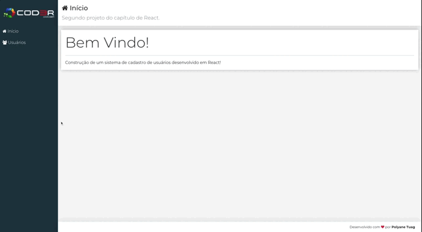

<h1 align="center">CRUD</h1>
<h2 align="center">Cadastro de usuário - Create, Read, Update, Delete </h2>

<div align="center">
    
</div>


### 📚 Sobre

Esse módulo é sobre os fundamentos e a prática em ReactJs/ NextJs em relação:
-  ao estilo(CSS) global e modularizado;
-  a criação de componentes; 
-  a integração do JSX com o JS
-  a navegação entre os componentes de forma simples e dinâmica;
-  a criação de componente com estado;
-  a integração com API;
-  e a criação de um conteúdo estático.

###  🚀 Tecnologias utilizadas

- ReactJs
- Bootstrap
- Font-awesome
- Axios
### ⏱ Começando

### API (Back-end)

```bash
# Clonar o repositório
$ git clone https://github.com/polyanetuag/crud.git 

# Entrar na pasta backend
$ cd backend

# Instalar as dependências
$ yarn install

# Iniciar o servidor
$ yarn start

```

### Web (Front-end)

```bash

# Entrar na pasta web 
$ cd frontend

# Instalar as dependências
$ yarn install

# Iniciar a aplicação
$ yarn start

```

###  📋 Licença
Esse projeto está sob a licença MIT.

---
Desenvolvido com 💜 por Polyane Tuag


